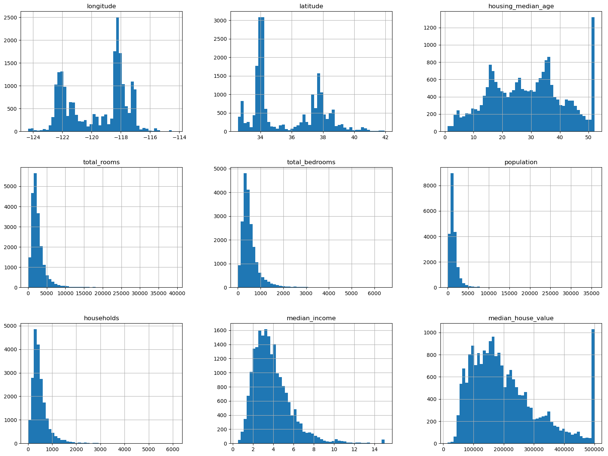

## Machine/Deep Learning Enchantment : My 90 Day Challenge to Master the Art of AI

Welcome to my repository for the 90 Days bootcamp where i will be diving deeper into the hidden secrets of Machine Learning and Deep Learning! Over the next 90 days, I'll be documenting my progress as I work through the book "Hands-On Machine Learning with Scikit-Learn, Keras, and TensorFlow" by Aurélien Géron and complete other machine learning and deep learning projects.

### Days

#### 1. Day 1 : Introduction to Machine Learning

  - The chapter introduces the concepts of machine learning, its applications, and its importance in today's world.
  - It explains the difference between traditional programming and machine learning, where the latter involves training a model to find patterns in data and make predictions or           decisions.
  - The three main categories of machine learning are introduced: supervised learning (where the data is labeled), unsupervised learning (where the data is unlabeled), and reinforcement learning (where the model learns by trial and error through interactions with an environment).
  - The chapter discusses the most common types of supervised learning problems: classification (where the model predicts a categorical label) and regression (where the model predicts a continuous numerical value).
  - The importance of preparing the data before feeding it to a machine learning model is emphasized, and the common steps involved in data preparation (such as cleaning, scaling, and feature engineering) are briefly explained.
  - Difference between online learning and batch learning and when to use each one of them
  - Instance-based vs model-based learning
  - I learned also about the unreasonable effectiveness of Data and the samling bias
  - Overfitting vs underfitting
  - Hyperparameter tuning and model selection

#### 2. [Day 2](./Day2): Setting up the environment

  Today, I started by setting up my environment and exploring the titanic famous dataset. Here's a breakdown of what I accomplished today:

- Installed the Anaconda environment and the necessary packages for machine learning, including Jupyter, Scikit-Learn, Seaborn, and the latest version of Python.
- Downloaded the titnic dataset from the author's GitHub repository and loaded it into a Pandas DataFrame.
- Explored the dataset using various Pandas functions to get a better understanding of its structure and features.
- Visualized the distribution of the target variable using Matplotlib and Seaborn.
- Cleaned the data by removing missing values and creating new features.
- Visualized the correlation between the features and the target variable using a heatmap.

I also spent some time familiarizing myself with Jupyter Notebooks and the various shortcuts and plugins available for data visualization in machine learning. Overall, it was a productive start to the challenge, and I'm excited to continue learning and building my machine learning skills.

   

  #### 2. [Day 3](./Day3): California Housing Prices

 In this chapter, we were introduced to an end-to-end project about California Housing Prices, where we learned about the following:

    - Introduction to the California Housing dataset, which contains information about the median housing prices in various districts in California.
    - Loading the dataset into a Pandas DataFrame and exploring it using various techniques, such as checking for missing values, computing summary statistics, and visualizing the distribution of the target variable (median housing price) and other features.
    - Creating a test set to evaluate the performance of the machine learning model on unseen data.
    - Preprocessing the data by scaling the numerical features using Scikit-Learn's StandardScaler, and transforming the categorical feature "ocean proximity" into numerical features using one-hot encoding with Scikit-Learn's OneHotEncoder.
    - Training a linear regression model on the preprocessed data using Scikit-Learn's LinearRegression, and evaluating its performance using mean squared error and mean absolute error.
    - Engineering new features, such as the population per household and the rooms per household, to improve the model's performance.
    - Training a more complex polynomial regression model using Scikit-Learn's PolynomialFeatures.
    - Introducing the concept of overfitting and underfitting, and showing how to use cross-validation to tune the hyperparameters of the model and select the best model based on its generalization performance on the validation set.

   

...

### Conclusion

That's it for now! I hope you find this repository helpful in your own journey through machine learning and deep learning. If you have any feedback or questions, feel free to reach out to me.
